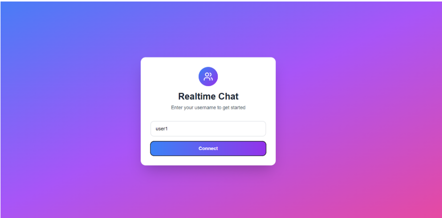
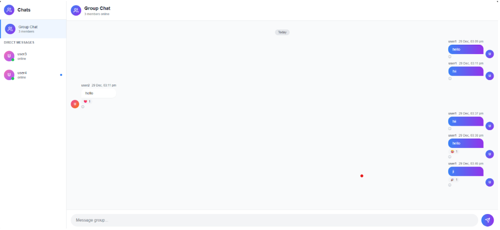
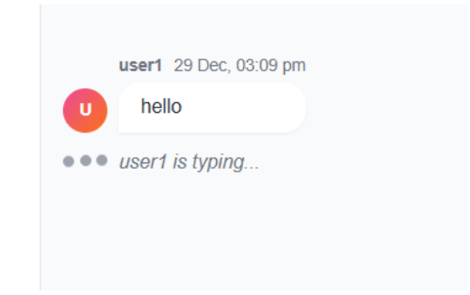
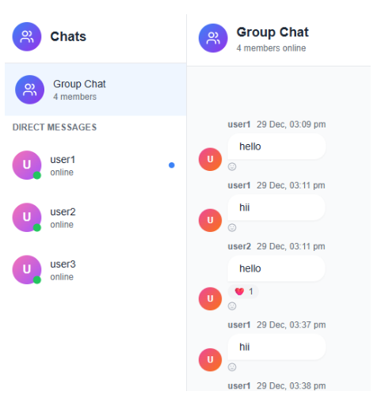
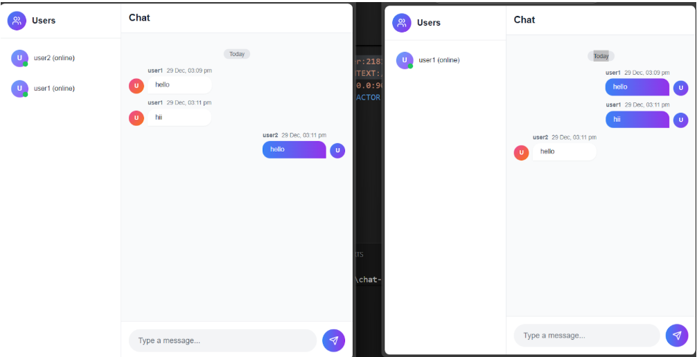
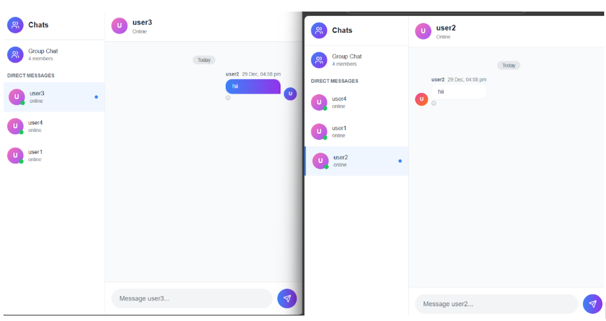

# Realtime Chat System

> A scalable real-time chat application with presence tracking, typing indicators, and event-driven logging

**A production-style chat system with instant messaging, user presence, 1-to-1 DMs, and activity logging. Built with Socket.IO, Redis, MongoDB, Kafka, and Elasticsearch.**

[](https://nodejs.org/)
[](https://socket.io/)
[](https://reactjs.org/)
[](https://redis.io/)
[](https://www.mongodb.com/)
[](https://kafka.apache.org/)
[](LICENSE)

## Overview

A scalable, real-time chat application built with modern web technologies and event-driven architecture. Features instant messaging, live presence tracking, typing indicators, and comprehensive activity logging through Kafka and Elasticsearch.

This project demonstrates how to build a production-ready chat system with proper state management, message persistence, and distributed logging—perfect for learning real-time systems and microservice patterns.

### Why This Project?

- **Real-time communication** - Learn WebSocket-based bidirectional messaging
- **Distributed systems** - Understand Redis, Kafka, and Elasticsearch integration
- **Scalable architecture** - Event-driven design with persistent storage
- **Production patterns** - Presence management, message sync, and activity logging
- **Modern stack** - Socket.IO, React, Tailwind CSS, and containerized services

## Features

### Core Messaging
- ✅ **Instant messaging** with Socket.IO for real-time delivery
- ✅ **Direct messages (DMs)** - Private 1-to-1 conversations
- ✅ **Message persistence** - Chat history stored in MongoDB
- ✅ **Message synchronization** - Consistent state across all clients

### User Experience
- ✅ **User presence tracking** - Live online/offline status with Redis
- ✅ **Typing indicators** - Real-time typing status notifications
- ✅ **User discovery** - Order-independent user registry
- ✅ **Clean UI** - Modern interface with Tailwind CSS

### Infrastructure & Logging
- ✅ **Activity logging** - Asynchronous event streaming with Kafka
- ✅ **Analytics** - Searchable logs and insights with Elasticsearch
- ✅ **Containerized services** - Docker Compose for easy deployment
- ✅ **Data visualization** - Charts and analytics with Recharts

> **Note:** This system uses a microservice-inspired architecture with separate concerns for messaging (Socket.IO), presence (Redis), persistence (MongoDB), and logging (Kafka + Elasticsearch).

## Technology Stack

**Frontend:**
- React 18 + Vite
- Socket.IO Client
- Tailwind CSS (styling)
- Recharts (data visualization)

**Backend:**
- Node.js + Express
- Socket.IO (WebSocket server)

**Infrastructure:**
- Redis (user presence & in-memory state)
- MongoDB (message persistence)
- Apache Kafka (event streaming)
- Elasticsearch (activity logs & analytics)
- Docker Compose (service orchestration)

## Project Structure

```
realtime-chat-system/
│
├── frontend/
│   ├── src/
│   │   ├── components/      # React components
│   │   ├── services/        # Socket.IO client logic
│   │   ├── App.jsx          # Main application
│   │   └── main.jsx         # Entry point
│   └── vite.config.js
│
├── backend/
│   ├── config/              # Service configurations
│   ├── controllers/         # Message & user handlers
│   ├── services/            # Redis, MongoDB, Kafka clients
│   ├── socket/              # Socket.IO event handlers
│   ├── models/              # MongoDB schemas
│   ├── server.js            # Entry point
│   └── package.json
│
├── docker-compose.yml       # Service orchestration
├── screenshots/             # Application screenshots
└── README.md
```

## Quick Start

### Prerequisites

- Node.js 16.x or higher
- Docker & Docker Compose (for Redis, Kafka, Elasticsearch, MongoDB)
- npm 7+

### Installation

**1. Clone the repository**

```bash
git clone https://github.com/yourusername/realtime-chat-system.git
cd realtime-chat-system
```

**2. Install Dependencies**

```bash
# Install all dependencies
npm install
```

**3. Start Infrastructure Services**

Start Redis, MongoDB, Kafka, Zookeeper, and Elasticsearch using Docker:

```bash
docker-compose up -d
```

This will start:
- Redis (port 6379)
- MongoDB (port 27017)
- Kafka (port 9092)
- Zookeeper (port 2181)
- Elasticsearch (port 9200)

**4. Start Backend Server**

```bash
# From project root
node server.js
```

Backend runs at `http://localhost:3000`

**5. Start Frontend**

Open a new terminal:

```bash
npm run dev
```

Frontend runs at `http://localhost:5173`

**6. Test the Application**

1. Open `http://localhost:5173` in two different browser windows
2. Enter different usernames in each window
3. Start chatting in real-time
4. Try sending direct messages
5. Watch typing indicators and presence status

**Quick Test Flow:**
```
Browser 1: Username "Alice"
Browser 2: Username "Bob"
→ Send messages and observe real-time delivery
→ Click on user to start DM conversation
→ See typing indicators when other person types
→ Check online/offline status changes
```

## Screenshots

### Login Interface


*Simple username entry to join the chat system*

### Real-time Chat Interface


*Main chat interface with message history and user list*

### Typing Indicators


*Live typing indicators show when users are composing messages*

### User Presence Tracking


*Real-time online/offline status for all connected users*

### Message Synchronization


*Consistent message delivery across all connected clients*

### Direct Messages (1-to-1 Chat)


*Private conversations between two users*

## Architecture

### System Design

```
┌─────────────┐
│   React     │ ← User Interface
│  Frontend   │
└──────┬──────┘
       │ Socket.IO
       ▼
┌─────────────┐
│  Socket.IO  │ ← Real-time Server
│   Server    │
└──────┬──────┘
       │
       ├─→ Redis         (User Presence)
       ├─→ MongoDB       (Message Storage)
       └─→ Kafka         (Activity Logs)
               └─→ Elasticsearch (Log Analytics)
```

### How It Works

**1. User Connection:**
- User enters username and connects via Socket.IO
- Server stores user info in Redis with "online" status
- User joins global room and personal room

**2. Messaging:**
- Messages sent through Socket.IO events
- Stored in MongoDB for persistence
- Broadcasted to all clients in the room
- Activity logged to Kafka

**3. Presence Tracking:**
- Redis maintains real-time user status
- Status updates on connect/disconnect
- All clients notified of presence changes

**4. Direct Messages:**
- Uses sorted user IDs to create consistent room names
- Format: `userId1_userId2` (alphabetically sorted)
- Ensures same room regardless of who initiated

**5. Activity Logging:**
- All events (messages, connections, DMs) sent to Kafka
- Elasticsearch indexes logs for search and analytics
- Async processing doesn't block real-time features

### Key Technologies Explained

| Technology | Purpose | Why We Use It |
|------------|---------|---------------|
| **Socket.IO** | Real-time bidirectional communication | Enables instant message delivery and typing indicators |
| **Redis** | In-memory user presence & fast state | Sub-millisecond access for online/offline status |
| **MongoDB** | Persistent message storage | Stores chat history with flexible schema |
| **Kafka** | Asynchronous event streaming | Decouples logging from real-time flow, scales independently |
| **Elasticsearch** | Searchable activity logs | Enables analytics, search, and insights on chat activity |
| **React** | Interactive UI | Component-based architecture for chat interface |
| **Tailwind CSS** | Utility-first styling | Rapid UI development with consistent design |

## Core Features Deep Dive

### Real-time Messaging

Messages are delivered instantly using Socket.IO's WebSocket connection:

```javascript
// Client sends message
socket.emit('sendMessage', { content: 'Hello!', room: 'general' });

// Server receives and broadcasts
socket.on('sendMessage', async (data) => {
  // Save to MongoDB
  await saveMessage(data);
  
  // Broadcast to room
  io.to(data.room).emit('newMessage', message);
  
  // Log to Kafka
  await logActivity('message_sent', data);
});
```

### User Presence with Redis

Redis stores user status with fast read/write access:

```javascript
// Store user as online
await redisClient.hSet('users', userId, JSON.stringify({
  username,
  status: 'online',
  lastSeen: Date.now()
}));

// Get all online users
const users = await redisClient.hGetAll('users');
```

**Key Insight:** Users are never deleted from Redis, only marked as "offline". This solves the order-dependency problem in DMs.

### Direct Messaging (DMs)

DM rooms use deterministic naming:

```javascript
// Create consistent room ID
const createDMRoom = (userId1, userId2) => {
  return [userId1, userId2].sort().join('_');
};

// Example: 'alice' and 'bob' always get 'alice_bob'
// regardless of who initiates the DM
```

### Activity Logging with Kafka

All events are logged asynchronously:

```javascript
// Log activity to Kafka
const logActivity = async (eventType, data) => {
  await producer.send({
    topic: 'chat-activity',
    messages: [{
      value: JSON.stringify({
        eventType,
        timestamp: Date.now(),
        data
      })
    }]
  });
};

// Consumer pushes to Elasticsearch
consumer.on('message', async (message) => {
  await elasticsearchClient.index({
    index: 'chat-logs',
    body: JSON.parse(message.value)
  });
});
```

## Configuration

### Environment Variables

Create a `.env` file in the backend directory:

```env
# Server Configuration
PORT=3000
NODE_ENV=development

# Redis Configuration
REDIS_HOST=localhost
REDIS_PORT=6379

# MongoDB Configuration
MONGODB_URI=mongodb://localhost:27017/chat-system

# Kafka Configuration
KAFKA_BROKER=localhost:9092
KAFKA_TOPIC=chat-activity

# Elasticsearch Configuration
ELASTICSEARCH_NODE=http://localhost:9200

# Frontend URL
CLIENT_URL=http://localhost:5173
```

### Docker Compose Services

The `docker-compose.yml` includes:

```yaml
version: '3.8'
services:
  redis:
    image: redis:7-alpine
    ports:
      - "6379:6379"
  
  mongodb:
    image: mongo:6
    ports:
      - "27017:27017"
  
  zookeeper:
    image: confluentinc/cp-zookeeper:latest
    environment:
      ZOOKEEPER_CLIENT_PORT: 2181
  
  kafka:
    image: confluentinc/cp-kafka:latest
    ports:
      - "9092:9092"
    depends_on:
      - zookeeper
  
  elasticsearch:
    image: docker.elastic.co/elasticsearch/elasticsearch:8.11.0
    ports:
      - "9200:9200"
    environment:
      - discovery.type=single-node
```

## API / Socket Events

### Client → Server Events

| Event | Payload | Description |
|-------|---------|-------------|
| `joinChat` | `{ username }` | User joins the chat system |
| `sendMessage` | `{ content, room }` | Send message to room |
| `startDM` | `{ recipientId }` | Initiate direct message |
| `typing` | `{ room, isTyping }` | Update typing status |
| `disconnect` | - | User disconnects |

### Server → Client Events

| Event | Payload | Description |
|-------|---------|-------------|
| `userJoined` | `{ user }` | New user connected |
| `userLeft` | `{ userId }` | User disconnected |
| `newMessage` | `{ message }` | New message received |
| `userTyping` | `{ userId, isTyping }` | User typing status |
| `presenceUpdate` | `{ users }` | Updated user list |

## Key Learnings & Problem Solving

### Problem: Order-Dependent Direct Messages

**Initial Issue:**
Direct messages only worked if users joined in a specific order. If Alice joined before Bob, DMs worked. If Bob joined first, they failed.

**Root Cause:**
DM rooms were created dynamically using `user1_user2` format, but the order wasn't consistent.

**Solution:**
```javascript
// Before (broken)
const roomId = `${senderId}_${recipientId}`;

// After (fixed)
const roomId = [senderId, recipientId].sort().join('_');
```

Additionally, implemented persistent user registry:
- Users stored in Redis permanently
- Status updates to "offline" instead of deletion
- Consistent user discovery regardless of join order

### Problem: Message Synchronization

**Challenge:**
Ensuring all clients receive messages in the correct order and state stays consistent.

**Solution:**
- MongoDB provides single source of truth
- Messages include timestamps for ordering
- Socket.IO rooms ensure targeted delivery
- Redis tracks which users are in which rooms

### Problem: Presence Management at Scale

**Challenge:**
Tracking online/offline status efficiently without polling.

**Solution:**
- Redis hash for O(1) user lookups
- Socket.IO connection events trigger presence updates
- Broadcast presence changes to all clients
- Heartbeat mechanism (optional) for stale detection

## Troubleshooting

### Docker Services Won't Start

**Symptom:** `docker-compose up` fails or services crash

**Solutions:**
```bash
# Check if ports are already in use
netstat -ano | findstr :6379  # Redis
netstat -ano | findstr :27017 # MongoDB
netstat -ano | findstr :9092  # Kafka

# Stop all containers and remove volumes
docker-compose down -v

# Restart services
docker-compose up -d

# Check logs
docker-compose logs -f
```

---

### Redis Connection Fails

**Symptom:** "Error: connect ECONNREFUSED 127.0.0.1:6379"

**Solutions:**
- Verify Redis container is running: `docker ps`
- Check Redis logs: `docker-compose logs redis`
- Test connection: `redis-cli ping` (should return "PONG")
- Ensure REDIS_HOST in `.env` matches container name

---

### MongoDB Connection Issues

**Symptom:** "MongooseServerSelectionError"

**Solutions:**
```bash
# Verify MongoDB is running
docker-compose ps mongodb

# Test connection
mongosh mongodb://localhost:27017

# Check logs
docker-compose logs mongodb

# Ensure MONGODB_URI is correct in .env
MONGODB_URI=mongodb://localhost:27017/chat-system
```

---

### Kafka Not Receiving Messages

**Symptom:** Messages sent but not logged in Elasticsearch

**Solutions:**
- Verify Kafka and Zookeeper are both running
- Check topic exists: `docker exec -it <kafka-container> kafka-topics --list --bootstrap-server localhost:9092`
- Monitor Kafka logs: `docker-compose logs kafka`
- Verify Kafka broker URL in `.env`

---

### Messages Not Appearing in Real-time

**Symptom:** Chat works but messages delayed or missing

**Solutions:**
- Check browser console for Socket.IO errors
- Verify Socket.IO connection: Look for "Connected" message
- Ensure both frontend and backend are running
- Check CORS configuration in backend
- Clear browser cache and reconnect

```javascript
// Check connection status in browser console
socket.on('connect', () => console.log('Connected'));
socket.on('disconnect', () => console.log('Disconnected'));
```

---

### Typing Indicators Not Working

**Symptom:** Typing status doesn't show

**Solutions:**
- Verify typing events are emitted: Check browser network tab
- Ensure room IDs match for sender and receiver
- Check that typing timeout is reasonable (2-3 seconds)
- Verify Socket.IO event listeners are registered

---

### Users Stuck as "Online" After Disconnect

**Symptom:** Users show online even after closing browser

**Solutions:**
- Implement heartbeat mechanism
- Handle browser close events properly
- Add timeout for inactive users
- Clean up Redis on disconnect events

```javascript
// Proper cleanup on disconnect
socket.on('disconnect', async () => {
  await redisClient.hSet('users', userId, JSON.stringify({
    ...user,
    status: 'offline',
    lastSeen: Date.now()
  }));
});
```

## Performance Optimization

### Recommended Practices

**1. Message Pagination**
```javascript
// Load only recent messages
const messages = await Message.find({ room })
  .sort({ timestamp: -1 })
  .limit(50);
```

**2. Redis Connection Pooling**
```javascript
const redis = new Redis({
  maxRetriesPerRequest: 3,
  enableReadyCheck: true,
  lazyConnect: true
});
```

**3. Socket.IO Namespaces**
```javascript
// Separate concerns
const chatNamespace = io.of('/chat');
const adminNamespace = io.of('/admin');
```

**4. Kafka Batch Processing**
```javascript
// Batch log events every 5 seconds
const buffer = [];
setInterval(async () => {
  if (buffer.length > 0) {
    await producer.send({
      topic: 'chat-activity',
      messages: buffer
    });
    buffer.length = 0;
  }
}, 5000);
```

## Testing

### Manual Testing Checklist

- [ ] User can join chat with username
- [ ] Messages appear in real-time
- [ ] Typing indicators work
- [ ] User presence updates correctly
- [ ] Direct messages work between any two users
- [ ] Messages persist after refresh
- [ ] Multiple browser tabs work simultaneously
- [ ] Disconnect/reconnect works properly

### Load Testing (Optional)

```bash
# Install artillery
npm install -g artillery

# Create load test config (test.yml)
# Run load test
artillery run test.yml
```

## Deployment (Optional)

### Production Considerations

**Before deploying:**
- [ ] Use production MongoDB instance (MongoDB Atlas)
- [ ] Use managed Redis (Redis Cloud, AWS ElastiCache)
- [ ] Use managed Kafka (Confluent Cloud, AWS MSK)
- [ ] Add authentication and authorization
- [ ] Implement rate limiting
- [ ] Enable HTTPS
- [ ] Add monitoring (Prometheus, Grafana)
- [ ] Set up logging (Winston, ELK stack)
- [ ] Configure environment variables properly
- [ ] Add health check endpoints

**Deployment platforms:**
- Frontend: Vercel, Netlify, AWS S3 + CloudFront
- Backend: AWS EC2, DigitalOcean, Heroku, Railway
- Database: MongoDB Atlas, AWS DocumentDB
- Redis: Redis Cloud, AWS ElastiCache
- Kafka: Confluent Cloud, AWS MSK

## Future Enhancements

**Core Features:**
- Group chat rooms with admin controls
- File and image sharing
- Message editing and deletion
- Message reactions (emoji)
- Read receipts
- Voice and video calling

**User Experience:**
- User profiles with avatars
- Custom themes and dark mode
- Message search functionality
- Notification system
- Mobile app (React Native)

**Infrastructure:**
- Horizontal scaling with Redis Pub/Sub
- Message queuing for offline users
- Database sharding for large scale
- CDN for media files
- WebRTC for peer-to-peer features

**Security:**
- End-to-end encryption
- Message content moderation
- Rate limiting per user
- Spam detection
- User blocking and reporting

## Contributing

Contributions are welcome! Please follow these steps:

1. Fork the repository
2. Create a feature branch (`git checkout -b feature/group-chats`)
3. Commit your changes (`git commit -m 'Add group chat feature'`)
4. Push to the branch (`git push origin feature/group-chats`)
5. Open a Pull Request

Please ensure:
- Code is well-documented
- Socket.IO events are properly handled
- Redis and MongoDB connections are managed
- Tests pass (if applicable)

## License

This project is licensed under the MIT License - see the [LICENSE](LICENSE) file for details.

## Acknowledgments

Built as a learning project to understand:
- Real-time communication with WebSockets
- Distributed systems architecture
- Event-driven logging and analytics
- State management across multiple services
- Production-ready chat application patterns

Special thanks to the open-source community for Socket.IO, Redis, MongoDB, Kafka, and Elasticsearch documentation.

## Author

**Naina Kothari**  
GitHub: [@NainaKothari-14](https://github.com/NainaKothari-14)

---

⭐ Star this repo if you found it helpful! | Built with Socket.IO, Redis, MongoDB, Kafka & Elasticsearch
